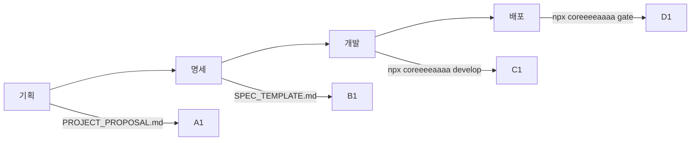

# coreeeeaaaa

> **Spec-Driven Development Framework for AI Teams**
> 명확한 역할: 개발 프레임워크 제공
> 버전: 2.0.0 (완전 재정의)

---

## 🎯 coreeeeaaaa가 하는 것

**coreeeeaaaa**는 AI 기반 개발팀을 위한 **프레임워크**입니다:

```yaml
제공하는 것:
  - 템플릿: 기획서, SpecKit 명세
  - 도구: CLI, MCP Server, SDK
  - 가이드: 워크플로우, 모범 사례
  - 검증: Gate 시스템

하지 않는 것:
  - 프로젝트를 직접 관리하지 않음
  - 코드를 자동으로 생성하지 않음
  - 프로젝트 상태를 저장하지 않음
```

---

## 📁 구조

```
coreeeeaaaa/                          # 프레임워크 루트
├── packages/                          # 프레임워크 코드
│   ├── cli/                           # CLI 도구
│   ├── core/                          # MCP 서버
│   └── sdk/                           # 라이브러리
│
├── templates/                         # 제공용 템플릿
│   ├── PROJECT_PROPOSAL.md            # 기획서
│   └── SPEC_TEMPLATE.md               # SpecKit
│
├── docs/                              # 프레임워크 문서
│   ├── AI_TEAM_WORKFLOW.md            # 워크플로우 가이드
│   ├── RISK_MANAGEMENT.md             # 리스크 관리
│   ├── VISUALIZATION.md               # 시스템 다이어그램
│   └── MAINTENANCE.md                 # 유지보수 가이드
│
└── STRUCTURE.md                       # 구조 정의서 (중요!)
```

**상세한 구조와 역할 분리**: [STRUCTURE.md](STRUCTURE.md) 참조

---

## 🚀 빠른 시작

### 1단계: 프로젝트 생성

```bash
# 프로젝트 초기화
npx coreeeeaaaa init my-project

# 생성되는 구조
my-project/
├── .core-project/                     # 프로젝트 상태
├── templates/                         # 복사된 템플릿
├── src/                              # 프로젝트 코드
└── tests/                            # 프로젝트 테스트
```

### 2단계: 기획서 작성

```bash
cd my-project

# 템플릿 복사
cp templates/PROJECT_PROPOSAL.md proposals/my-project.md

# 기획서 작성 (vim 또는 IDE)
vim proposals/my-project.md
```

### 3단계: SpecKit 변환

```bash
# SpecKit 템플릿 복사
cp templates/SPEC_TEMPLATE.md specs/my-project.spec.md

# 기획서 내용을 SpecKit 형식으로 변환
vim specs/my-project.spec.md
```

### 4단계: 개발

```bash
# SpecKit 기반 개발 시작
npx coreeeeaaaa develop specs/my-project.spec.md

# Gate 검증
npx coreeeeaaaa gate
```

---

## 📖 문서

### 필독 문서

1. **[STRUCTURE.md](STRUCTURE.md)** - 구조 정의서 (역할/경계 명확화)
2. **[docs/AI_TEAM_WORKFLOW.md](docs/AI_TEAM_WORKFLOW.md)** - AI 팀 협업 가이드
3. **[docs/RISK_MANAGEMENT.md](docs/RISK_MANAGEMENT.md)** - 리스크 관리
4. **[docs/VISUALIZATION.md](docs/VISUALIZATION.md)** - 시스템 다이어그램
5. **[docs/MAINTENANCE.md](docs/MAINTENANCE.md)** - 유지보수 가이드

### 가이드 순서

```yaml
시작:
  - README.md (이 파일)
  - STRUCTURE.md

사용:
  - templates/PROJECT_PROPOSAL.md
  - templates/SPEC_TEMPLATE.md
  - docs/AI_TEAM_WORKFLOW.md

운영:
  - docs/RISK_MANAGEMENT.md
  - docs/MAINTENANCE.md
```

---

## 🔄 워크플로우

### 4단계 프로세스



상세 내용: [docs/AI_TEAM_WORKFLOW.md](docs/AI_TEAM_WORKFLOW.md)

---

## 🤖 에이전트 역할

AI 개발팀의 역할 분담:

```yaml
Product Owner:
  - 기획서 작성
  - 요구사항 정의
  - 우선순위 결정

Architect:
  - 기획서를 SpecKit으로 변환
  - 아키텍처 설계
  - API 명세 작성

Developer:
  - SpecKit 기반 구현
  - 단위 테스트 작성
  - gate 검증 통과

QA Engineer:
  - 통합 테스트 작성
  - E2E 테스트 작성
  - 버그 추적

DevOps:
  - CI/CD 파이프라인 구축
  - 배포 자동화
  - 모니터링 설정
```

---

## 🛠️ CLI 도구

### 명령어

```bash
# 프로젝트 초기화
npx coreeeeaaaa init <project-name>

# 개발 시작
npx coreeeeaaaa develop <spec-file>

# Gate 검증
npx coreeeeaaaa gate

# 로그 기록
npx coreeeeaaaa log --add --text "작업 완료"

# 로그 확인
npx coreeeeaaaa log --tail
```

### MCP Server

```bash
# MCP 서버 실행
npm run core:mcp

# Health check
curl http://127.0.0.1:24282/health
```

---

## 📦 패키지

```yaml
@coreeeeaaaa/cli:
  - 설치: npm install -g @coreeeeaaaa/cli
  - 용도: 터미널에서 직접 사용

@coreeeeaaaa/core:
  - 설치: Claude Desktop 설정
  - 용도: AI가 도구로 사용

@coreeeeaaaa/sdk:
  - 설치: npm install @coreeeeaaaa/sdk
  - 용도: 프로젝트에 import해서 사용
```

---

## 🎯 사용 사례

### 1. 새 프로젝트 시작

```bash
npx coreeeeaaaa init my-todo-app
cd my-todo-app
# 기획 → 명세 → 개발 → 배포
```

### 2. 기존 프로젝트에 적용

```bash
cd existing-project
npx coreeeeaaaa init
# 템플릿 추가
```

### 3. AI 팀과 협업

```bash
# GitHub 링크만 전달
https://github.com/coreeeeaaaa/coreeeeaaaa

# AI가 스스로 학습 후 개발
```

---

## ⚠️ 중요: 역할 구분

### coreeeeaaaa (프레임워크)

```yaml
역할: 도구 제공
위치: GitHub 또는 npm
상태: 상태 없음 (Stateless)
목적: 재사용 가능한 프레임워크
```

### 프로젝트 (사용자)

```yaml
역할: 실제 개발
위치: 사용자 로컬
상태: .core-project/에 저장
목적: 비즈니스 가치 창출
```

**상세 구분**: [STRUCTURE.md](STRUCTURE.md) 필독

---

## 📞 지원

### 문제 신고
```bash
gh issue create --repo coreeeeaaaa/coreeeeaaaa \
  --title "제목" \
  --body "문제 상세"
```

### 기능 요청
```bash
gh pr create --repo coreeeeaaaa/coreeeeaaaa \
  --title "feat: 새로운 기능" \
  --body "기능 상세"
```

---

## 📝 라이선스

Apache License 2.0

---

## 🔗 링크

- **GitHub**: https://github.com/coreeeeaaaa/coreeeeaaaa
- **문서**: https://github.com/coreeeeaaaa/coreeeeaaaa/tree/main/docs
- **구조**: [STRUCTURE.md](STRUCTURE.md)

---

**© 2025 coreeeeaaaa Framework. All rights reserved.**
