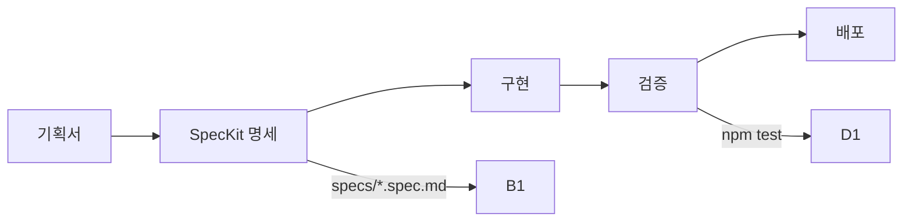

# coreeeeaaaa

> **Spec-Driven Development Framework for AI Teams**
> **정본(CANON)**: [CANON.md](CANON.md) 필독
> 버전: 3.0.0 (전문가급 표준화)

---

## 🎯 30초 요약

**coreeeeaaaa**는 Spec-Driven Development를 위한 **표준화 프레임워크**입니다.

```yaml
제공:
  - 표준: 개발 절차, 명세 형식, 검증 기준
  - 템플릿: 기획서, SpecKit 명세
  - 가이드: 워크플로우, 모벨 사례

하지 않음:
  - 코드 자동 생성 (X)
  - CLI 도구 제공 (X)
  - 프로젝트 관리 (X)
```

**시작하기**: 아래 "빠른 시작" 참조

---

## 🚀 빠른 시작

### 1단계: 템플릿 다운로드

```bash
# 프로젝트 생성
mkdir my-project
cd my-project

# 템플릿 다운로드
curl -O https://raw.githubusercontent.com/coreeeeaaaa/coreeeeaaaa/main/templates/PROJECT_PROPOSAL.md
curl -O https://raw.githubusercontent.com/coreeeeaaaa/coreeeeaaaa/main/templates/SPEC_TEMPLATE.md
```

### 2단계: 프로젝트 구조 생성

```bash
# .core-project/ 생성
mkdir -p .core-project/{specs,state,checkpoints}

# 소스 디렉토리 생성
mkdir src tests docs

# 템플릿 이동
mv PROJECT_PROPOSAL.md .core-project/
mv SPEC_TEMPLATE.md .core-project/specs/
```

### 3단계: 명세 작성

```bash
# 기획서 작성
vim .core-project/PROJECT_PROPOSAL.md

# SpecKit 변환
vim .core-project/specs/my-project.spec.md
```

### 4단계: 구현

```bash
# 코드 작성
vim src/index.js

# 테스트 작성
vim tests/index.test.js
```

### 5단계: 검증

```bash
# 테스트 실행
npm test

# Git 커밋
git add .
git commit -m "feat: 초기 구현"
```

---

## 📖 필독 문서

**순서대로 읽으세요:**

1. **[CANON.md](CANON.md)** - 프레임워크 정본 ⭐ **(가장 중요)**
2. **[STRUCTURE.md](STRUCTURE.md)** - 구조 정의서
3. **[templates/SPEC_TEMPLATE.md](templates/SPEC_TEMPLATE.md)** - SpecKit 템플릿

**추가 문서:**
- [docs/AI_TEAM_WORKFLOW.md](docs/AI_TEAM_WORKFLOW.md) - 워크플로우 가이드
- [docs/RISK_MANAGEMENT.md](docs/RISK_MANAGEMENT.md) - 리스크 관리
- [docs/VISUALIZATION.md](docs/VISUALIZATION.md) - 시스템 다이어그램

---

## 🔄 표준 워크플로우



상세: [CANON.md](CANON.md) 참조

---

## 🎯 핵심 원칙

### 1. Spec-Driven (명세 중심)

모든 개발은 SpecKit 명세부터 시작합니다.

### 2. Gate-Based (검증 기반)

모든 변경사항은 테스트 통과가 필수입니다.

### 3. Project Isolation (프로젝트 격리)

각 프로젝트는 독립적인 `.core-project/` 폴더를 가집니다.

상세: [CANON.md](CANON.md) 참조

---

## ⚠️ 중요

### coreeeeaaaa (프레임워크)

```yaml
역할: 표준/템플릿/가이드 제공
위치: GitHub
상태: 상태 없음 (Stateless)
```

### 프로젝트 (사용자)

```yaml
역할: 실제 개발
위치: 사용자 로컬
상태: .core-project/에 저장
```

---

## 📦 템플릿

### PROJECT_PROPOSAL.md
기획서 작성 템플릿

- 프로젝트 개요
- 목표 및 성공 기준
- 핵심 기능 요건
- 제약 사항

### SPEC_TEMPLATE.md
SpecKit 명세 작성 템플릿

- FR (기능 요구사항)
- NFR (비기능 요구사항)
- 아키텍처 설계
- API 명세

---

## 📞 지원

- **GitHub**: https://github.com/coreeeeaaaa/coreeeeaaaa
- **Issues**: https://github.com/coreeeeaaaa/coreeeeaaaa/issues

---

## 📝 라이선스

Apache License 2.0

---

**© 2025 coreeeeaaaa Framework. All rights reserved.**

**[CANON.md](CANON.md) (정본) | [STRUCTURE.md](STRUCTURE.md) (구조)**
