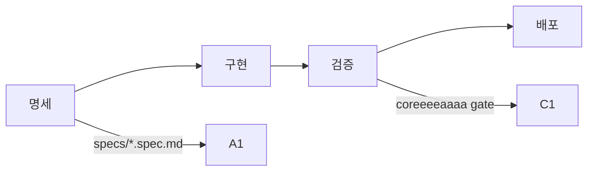

# coreeeeaaaa

> **Spec-Driven Development Framework for AI Teams**
> **정본(CANON)**: [CANON.md](CANON.md) 필독
> 버전: 3.0.0 (전문가급 표준화)

---

## 🎯 30초 요약

**coreeeeaaaa**는 개발 프레임워크입니다.

```yaml
제공:
  - 표준: 개발 절차, 명세 형식, 검증 기준
  - 도구: CLI, MCP Server, SDK
  - 가이드: 워크플로우, 모벨 사례

하지 않음:
  - 코드 자동 생성 (X)
  - 프로젝트 상태 관리 (X)
  - 개발 대행 (X)
```

**시작하기**: 아래 "빠른 시작" 참조

---

## 🚀 빠른 시작

### 1단계: 프레임워크 설치

```bash
# 전역 설치
npm install -g @coreeeeaaaa/cli
```

### 2단계: 프로젝트 생성

```bash
coreeeeaaaa init my-project
cd my-project
```

### 3단계: 명세 작성

```bash
# SpecKit 템플릿 복사
cp templates/SPEC_TEMPLATE.md specs/my-project.spec.md

# 명세 작성
vim specs/my-project.spec.md
```

### 4단계: 구현

```bash
# 코드 작성
vim src/index.js

# 테스트 작성
vim tests/index.test.js
```

### 5단계: 검증

```bash
# gate 검증
coreeeeaaaa gate

# 배포
git push origin main
```

---

## 📖 필독 문서

**순서대로 읽으세요:**

1. **[CANON.md](CANON.md)** - 프레임워크 정본 ⭐ **(가장 중요)**
2. **[STRUCTURE.md](STRUCTURE.md)** - 구조 정의서
3. **[templates/SPEC_TEMPLATE.md](templates/SPEC_TEMPLATE.md)** - SpecKit 템플릿

**추가 문서:**
- [docs/AI_TEAM_WORKFLOW.md](docs/AI_TEAM_WORKFLOW.md) - 워크플로우 가이드
- [docs/RISK_MANAGEMENT.md](docs/RISK_MANAGEMENT.md) - 리스크 관리
- [docs/VISUALIZATION.md](docs/VISUALIZATION.md) - 시스템 다이어그램

---

## 🔄 표준 워크플로우



상세: [CANON.md](CANON.md) 참조

---

## 🛠️ CLI 도구

### 설치

```bash
npm install -g @coreeeeaaaa/cli
```

### 주요 명령어

```bash
# 프로젝트 초기화
coreeeeaaaa init <project-name>

# gate 검증
coreeeeaaaa gate

# 로그 기록
coreeeeaaaa log --add --text "작업 완료"

# 로그 확인
coreeeeaaaa log --tail
```

### MCP Server

```bash
# MCP 서버 실행
npm run core:mcp

# Health check
curl http://127.0.0.1:24282/health
```

---

## 📦 패키지

```yaml
@coreeeeaaaa/cli:
  설치: npm install -g @coreeeeaaaa/cli
  용도: 터미널 CLI

@coreeeeaaaa/core:
  설치: Claude Desktop 설정
  용도: AI 도구 (MCP Server)

@coreeeeaaaa/sdk:
  설치: npm install @coreeeeaaaa/sdk
  용도: Node.js 라이브러리
```

---

## 🎯 핵심 원칙

### 1. Spec-Driven (명세 중심)

모든 개발은 SpecKit 명세부터 시작합니다.

### 2. Gate-Based (게이트 기반)

모든 변경사항은 gate 검증 통과가 필수입니다.

### 3. Project Isolation (프로젝트 격리)

각 프로젝트는 독립적인 `.core-project/` 폴더를 가집니다.

상세: [CANON.md](CANON.md) 참조

---

## ⚠️ 중요

### coreeeeaaaa (프레임워크)

```yaml
역할: 도구/표준 제공
위치: GitHub 또는 npm
상태: 상태 없음 (Stateless)
```

### 프로젝트 (사용자)

```yaml
역할: 실제 개발
위치: 사용자 로컬
상태: .core-project/에 저장
```

---

## 📞 지원

- **GitHub**: https://github.com/coreeeeaaaa/coreeeeaaaa
- **Issues**: https://github.com/coreeeeaaaa/coreeeeaaaa/issues

---

## 📝 라이선스

Apache License 2.0

---

**© 2025 coreeeeaaaa Framework. All rights reserved.**

**[CANON.md](CANON.md) (정본) | [STRUCTURE.md](STRUCTURE.md) (구조)**
