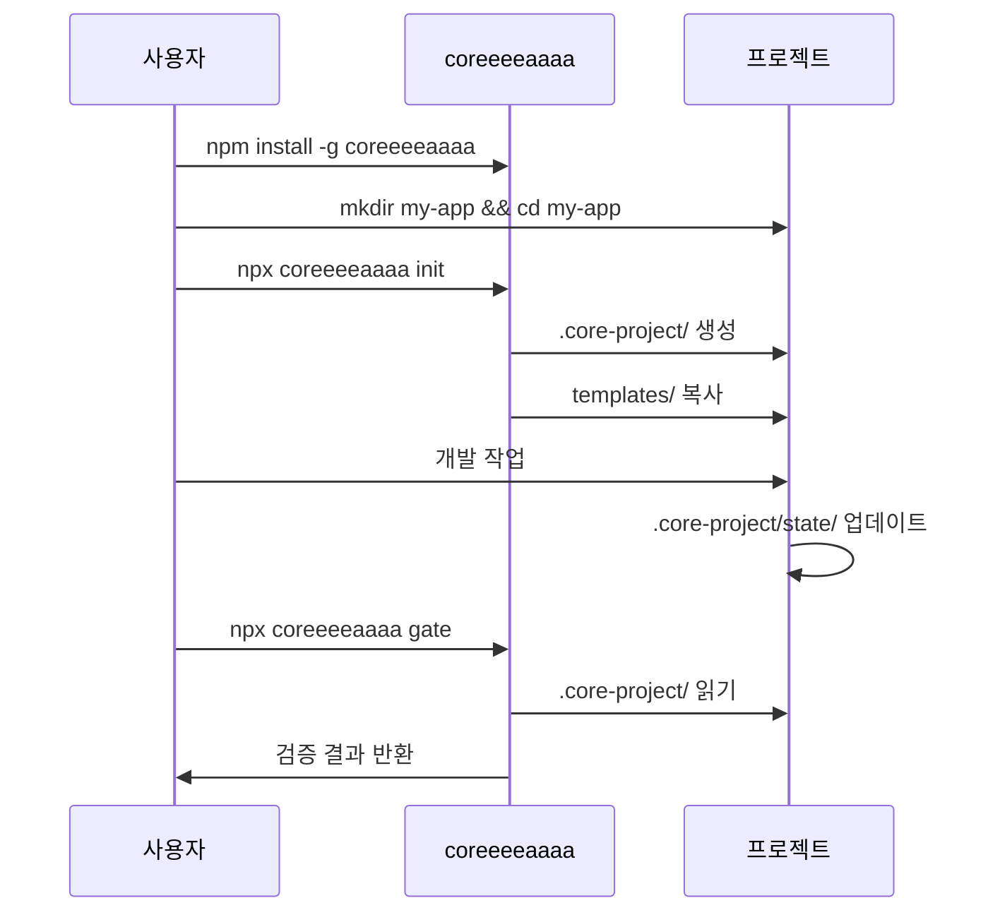

# coreeeeaaaa 구조 정의서

> **명확한 역할과 경계 정의**
> 버전: 3.0.0 (전문가급 표준화)
> 작성일: 2025-12-23
> 적용: 로컬, GitHub, 문서, 내부 모두 동일

---

## 🎯 핵심 원칙

### 1가지 역할만
coreeeeaaaa는 **오직 하나의 역할**만 합니다:
- **개발 프레임워크 제공** (Framework Provider)

coreeeeaaaa는 **절대 하지 않습니다**:
- ❌ 프로젝트를 직접 관리하지 않음
- ❌ 프로젝트 상태를 저장하지 않음 (.core-project/ 없음)
- ❌ 특정 프로젝트에 종속되지 않음

**참고:** `.coreeeeaaaa/` 디렉토리는 프레임워크 자체의 개발용 내부 상태이며, 사용자 프로젝트 상태와 무관합니다.

---

## 📁 디렉토리 구조

### 전체 구조

```
coreeeeaaaa/                          # 프레임워크 루트
│
├── templates/                         # 프로젝트 템플릿 (제공용)
│   ├── PROJECT_PROPOSAL.md            # 기획서 템플릿
│   └── SPEC_TEMPLATE.md               # SpecKit 템플릿
│
├── docs/                              # 프레임워크 문서
│   ├── AI_TEAM_WORKFLOW.md            # 워크플로우 가이드
│   ├── RISK_MANAGEMENT.md             # 리스크 관리
│   ├── VISUALIZATION.md               # 시스템 다이어그램
│   └── MAINTENANCE.md                 # 유지보수 가이드
│
├── .github/                           # GitHub 설정
│   └── workflows/                    # CI/CD (문서용)
│
├── .gitignore
├── CANON.md                           # 프레임워크 정본
├── STRUCTURE.md                       # 이 파일
└── README.md                          # 프레임워크 소개
```

---

## 🔄 사용자 프로젝트 구조

### coreeeeaaaa를 사용하는 프로젝트

```
my-todo-app/                           # 사용자 프로젝트
│
├── .core-project/                     # 이 프로젝트의 상태 (핵심)
│   ├── specs/                         # SpecKit 명세
│   │   └── todo-app.spec.md
│   ├── state/                         # 현재 상태
│   │   ├── current-task.json
│   │   └── agent-states.json
│   └── checkpoints/                   # 체크포인트
│       └── 2025-12-23/
│
├── src/                               # 사용자 코드
├── tests/                             # 사용자 테스트
├── docs/                              # 사용자 문서
│
├── package.json
└── README.md
```

### 핵심 차이점

| 항목 | coreeeeaaaa | 사용자 프로젝트 |
|------|-------------|-----------------|
| **역할** | 프레임워크 제공 | 프로젝트 개발 |
| **상태 저장** | `.core-project/` 없음 | `.core-project/` 있음 |
| **코드** | packages/ | src/ |
| **목적** | 다른 프로젝트에서 사용 | 실제 서비스 개발 |

---

## 🚫 금지 사항 (절대 하지 말 것)

### coreeeeaaaa 레포지토리에서

```yaml
절대 하지 말 것:
  - [ ] .core-project/ 생성 (금지)
  - [ ] 프로젝트 상태 저장 (금지)
  - [ ] 프로젝트 관련 파일 생성 (금지)
  - [ ] 특정 프로젝트를 위한 설정 (금지)

허용된 것:
  - [x] templates/ 제공
  - [x] examples/ 참고용 샘플
  - [x] docs/ 문서화
  - [x] packages/ 프레임워크 코드
```

### 사용자 프로젝트에서

```yaml
사용자가 해야 할 것:
  - [ ] .core-project/ 생성
  - [ ] 프로젝트 상태 저장
  - [ ] 프로젝트 관련 파일 생성
  - [ ] 프로젝트별 설정

하지 말 것:
  - [ ] coreeeeaaaa 프레임워크 수정 (불필요)
  - [ ] 템플릿 직접 수정 (복사해서 사용)
```

---

## 📖 명확한 용어 정의

### 1. coreeeeaaaa

```yaml
정의: 개발 프레임워크
위치: /usr/local/lib/node_modules/coreeeeaaaa/ 또는 GitHub
역할: 도구, 템플릿, 문서 제공
상태: 상태 없음 (Stateless)
목적: 재사용 가능한 도구 모음
```

### 2. 프로젝트 (Project)

```yaml
정의: coreeeeaaaa를 사용해서 만드는 실제 프로젝트
위치: 사용자가 선택한 디렉토리
역할: 실제 서비스/제품 개발
상태: .core-project/에 저장
목적: 비즈니스 가치 창출
```

### 3. .core-project/ vs .coreeeeaaaa/

```yaml
.coreeeeaaaa/:
  - 위치: coreeeeaaaa 레포지토리 내부
  - 내용: 프레임워크 문서, 예제
  - 용도: 프레임워크 개발/유지보수
  - Git: 관리됨

.core-project/:
  - 위치: 사용자 프로젝트 내부
  - 내용: 프로젝트 상태, 명세
  - 용도: 프로젝트 개발/운영
  - Git: 사용자가 결정
```

---

## 🔄 데이터 흐름

### 설치 및 사용 흐름



### 명확한 소유권

```yaml
소유권:
  packages/: coreeeeaaaa 유지
  templates/: coreeeeaaaa 유지
  docs/: coreeeeaaaa 유지

  .core-project/: 프로젝트 유지
  src/: 프로젝트 유지
  tests/: 프로젝트 유지
```

---

## 📊 파일 소유권 명확화

### coreeeeaaaa 레포지토리에서 관리하는 파일

```yaml
필수:
  - templates/**/*                   # 템플릿
  - docs/**/*                        # 프레임워크 문서
  - STRUCTURE.md                     # 이 파일
  - CANON.md                         # 정본
  - README.md                        # 프레임워크 소개

옵션:
  - examples/**/*                    # 참고용 예제 (추가 예정)

금지:
  - .core-project/                   # 프로젝트 상태 (금지)
  - src/                             # 사용자 코드 (금지)
  - tests/                           # 사용자 테스트 (금지)
  - packages/                        # 프레임워크 코드 (금지)
```

### 사용자 프로젝트에서 관리하는 파일

```yaml
필수:
  - .core-project/**/*               # 프로젝트 상태
  - src/**/*                         # 프로젝트 코드
  - tests/**/*                       # 프로젝트 테스트
  - README.md                        # 프로젝트 소개
  - package.json                     # 프로젝트 설정

금지:
  - packages/**/*                    # 프레임워크 코드 수정 불필요
```

---

## 🔍 혼란 방지를 위한 규칙

### 1. 디렉토리 명명 규칙

```yaml
프레임워크:
  - .coreeeeaaaa/                    # 프레임워크 개발용 (레포 내부)
  - packages/                        # 프레임워크 코드

프로젝트:
  - .core-project/                   # 프로젝트 상태
  - src/                             # 프로젝트 코드

절대 혼용 금지:
  - coreeeeaaaa/                     # 모호함
  - .project/                        # 모호함
```

### 2. 파일 명명 규칙

```yaml
프레임워크 문서:
  - USER_GUIDE.md                    # 사용자를 위한 가이드
  - ARCHITECTURE.md                  # 아키텍처 설명
  - API.md                           # API 문서

프로젝트 문서:
  - README.md                        # 프로젝트 소개
  - DESIGN.md                        # 설계 문서
  - CHANGELOG.md                     # 변경 이력
```

### 3. 환경변수 규칙

```yaml
프레임워크:
  - CORE_FRAMEWORK_HOME              # 프레임워크 설치 위치
  - CORE_TEMPLATE_PATH               # 템플릿 위치

프로젝트:
  - CORE_PROJECT_STATE               # 프로젝트 상태 위치
  - CORE_PROJECT_NAME                # 프로젝트 이름
```

---

## 📞 FAQ

### Q1: coreeeeaaaa는 내 프로젝트를 관리하나요?
**A:** 아닙니다. coreeeeaaaa는 도구만 제공합니다. 프로젝트 상태는 각 프로젝트의 `.core-project/`에 저장됩니다.

### Q2: examples/는 프로젝트인가요?
**A:** 아닙니다. 참고용 예제일 뿐입니다. 실제 개발은 별도 프로젝트 디렉토리에서 하세요.

### Q3: .coreeeeaaaa/와 .core-project/의 차이는?
**A:**
- `.coreeeeaaaa/`: 프레임워크 개발/문서 (레포 내부)
- `.core-project/`: 프로젝트 상태/명세 (사용자 프로젝트 내부)

### Q4: 템플릿을 수정해야 하나요?
**A:** 아닙니다. 템플릿을 복사해서 수정하세요.

---

## 📝 변경 이력

| 버전 | 날짜 | 변경 내용 |
|------|------|-----------|
| 2.0.0 | 2025-12-23 | 완전 재정의: 역할/경계 명확화 |
| 1.x.x | 이전 | 혼재된 구조 (사용 중지) |

---

**© 2025 coreeeeaaaa Framework. All rights reserved.**
