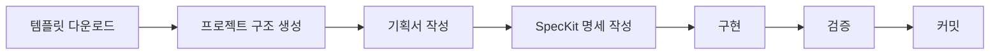

# AI 로컬 작업 가이드

> **Claude Code/Agent를 위한 coreeeeaaaa 사용 방법**
> 버전: 3.0.0
> 작성일: 2025-12-23

---

## 🎯 목적

AI(Claude Code, Cursor, Copilot 등)가 로컬에서 coreeeeaaaa Framework를 사용하여 프로젝트를 진행하는 절차를 정의합니다.

---

## 🚀 빠른 시작

### 1단계: 템플릿 다운로드

```bash
# 프로젝트 생성
mkdir my-project
cd my-project

# 템플릿 다운로드
curl -O https://raw.githubusercontent.com/coreeeeaaaa/coreeeeaaaa/main/templates/PROJECT_PROPOSAL.md
curl -O https://raw.githubusercontent.com/coreeeeaaaa/coreeeeaaaa/main/templates/SPEC_TEMPLATE.md
```

### 2단계: 프로젝트 구조 생성

```bash
# .core-project/ 생성
mkdir -p .core-project/{specs,state,checkpoints}

# 소스 디렉토리 생성
mkdir src tests docs

# 템플릿 이동
mv PROJECT_PROPOSAL.md .core-project/
mv SPEC_TEMPLATE.md .core-project/specs/

# Git 초기화
git init
```

### 3단계: 기획서 작성

```bash
# AI에게 요청
```

**AI 프롬프트:**
```
.core-project/PROJECT_PROPOSAL.md 템플릿을 참고해서
[프로젝트 아이디어]에 대한 기획서를 작성해줘.
```

### 4단계: SpecKit 명세 작성

```bash
# AI에게 요청
```

**AI 프롬프트:**
```
.core-project/PROJECT_PROPOSAL.md를 참고해서
.core-project/specs/my-project.spec.md에 SpecKit 명세를 작성해줘.
```

### 5단계: 구현

```bash
# AI에게 요청
```

**AI 프롬프트:**
```
.core-project/specs/my-project.spec.md에 따라서
구현을 시작해줘. src/에 코드를 작성하고 tests/에 테스트를 작성해.
```

### 6단계: 검증

```bash
# 테스트 실행
npm test

# Git 커밋
git add .
git commit -m "feat: 초기 구현"
```

---

## 📋 전체 워크플로우



---

## 🤖 AI별 사용 방법

### Claude Code

```bash
# 1. Claude Code 시작
code .

# 2. Context 설정
# CANON.md 먼저 읽기
# STRUCTURE.md 읽기

# 3. 작업 요청
"coreeeeaaaa Framework를 따라서 TODO 앱을 만들어줘"

# 4. AI가 자동으로:
# - .core-project/ 생성
# - 템플릿 다운로드
# - 기획서 작성
# - SpecKit 변환
# - 구현
# - 테스트
```

### Cursor / VS Code + Copilot

```bash
# 1. 프로젝트 열기
cursor my-project

# 2. Chat에 요청
"coreeeeaaaa Framework의 절차에 따라서
프로젝트를 설정하고 구현해줘"

# 3. AI가 단계별로 안내
```

---

## 📁 필수 디렉토리 구조

```
my-project/
├── .core-project/        # 프로젝트 상태 (핵심)
│   ├── specs/            # SpecKit 명세
│   │   └── my-project.spec.md
│   ├── state/            # 현재 상태
│   │   ├── current-phase.json
│   │   └── quality-report.json
│   └── checkpoints/      # 체크포인트
│       └── 2025-12-23/
│
├── src/                  # 소스 코드
├── tests/                # 테스트
├── docs/                 # 문서
├── README.md             # 프로젝트 소개
└── package.json
```

---

## 🔑 핵심 원칙

### 1. Spec-Driven

모든 개발은 SpecKit 명세부터 시작합니다.

```yaml
순서:
  1. 기획서 (PROJECT_PROPOSAL.md)
  2. SpecKit 명세 (specs/*.spec.md)
  3. 구현 (src/)
  4. 테스트 (tests/)
```

### 2. Phase-Based

각 단계를 완료한 후 다음 단계로 넘어갑니다.

```yaml
Phase 1: Planning
  - 산출물: PROJECT_PROPOSAL.md

Phase 2: Specification
  - 산출물: specs/*.spec.md

Phase 3: Implementation
  - 산출물: src/, tests/

Phase 4: Verification
  - 산출물: 테스트 통과
```

### 3. Checkpoint

각 중요 단계마다 체크포인트를 생성합니다.

```bash
# 체크포인트 생성
mkdir -p .core-project/checkpoints/2025-12-23
echo "완료된 작업 내용" > .core-project/checkpoints/2025-12-23/phase1.md
```

---

## 💬 AI 프롬프트 예시

### 프로젝트 시작

```
coreeeeaaaa Framework를 따라서 간단한 TODO 앱을 만들어줘.

1. 먼저 templates/에서 템플릿을 다운로드
2. .core-project/ 구조 생성
3. PROJECT_PROPOSAL.md 작성
4. SpecKit 명세 변환
5. 구현
```

### 기획서 작성

```
.core-project/PROJECT_PROPOSAL.md 템플릿을 참고해서
사용자 인증이 포함된 TODO 앱에 대한 기획서를 작성해줘.

요구사항:
- 이메일/비밀번호 로그인
- CRUD TODO
- 간단한 UI
```

### SpecKit 명세 작성

```
.core-project/PROJECT_PROPOSAL.md를 참고해서
.core-project/specs/todo-app.spec.md에 SpecKit 명세를 작성해줘.

포함할 내용:
- FR (기능 요구사항)
- NFR (비기능 요구사항)
- API 명세
- 데이터 모델
```

### 구현

```
.core-project/specs/todo-app.spec.md에 따라서 구현을 시작해줘.

1. src/index.js부터 시작
2. 테스트도 함께 작성
3. 각 기능을 완료한 후 다음 기능
```

### 검증

```
모든 구현이 완료되었어. 테스트를 실행하고 결과를 알려줘.

npm test
```

---

## ⚠️ 주의사항

### 하지 말아야 할 것

```yaml
절대 하지 말 것:
  - [ ] 명세 없이 코드 작성
  - [ ] 테스트 없이 구현
  - [ ] 한 번에 모든 것을 구현
  - [ ] .core-project/ 무시
```

### 반드시 해야 할 것

```yaml
반드시 해야 할 것:
  - [ ] 기획서부터 시작
  - [ ] SpecKit 명세 작성
  - [ ] 단계별 진행
  - [ ] 테스트 작성
  - [ ] 체크포인트 생성
```

---

## 📚 추가 자료

- [CANON.md](../CANON.md) - 프레임워크 정본
- [STRUCTURE.md](../STRUCTURE.md) - 구조 정의
- [templates/SPEC_TEMPLATE.md](../templates/SPEC_TEMPLATE.md) - SpecKit 템플릿

---

**© 2025 coreeeeaaaa Framework. All rights reserved.**
