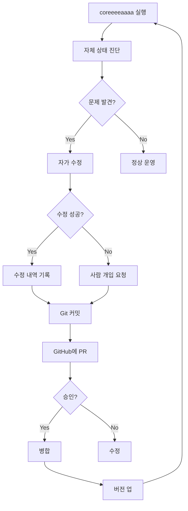
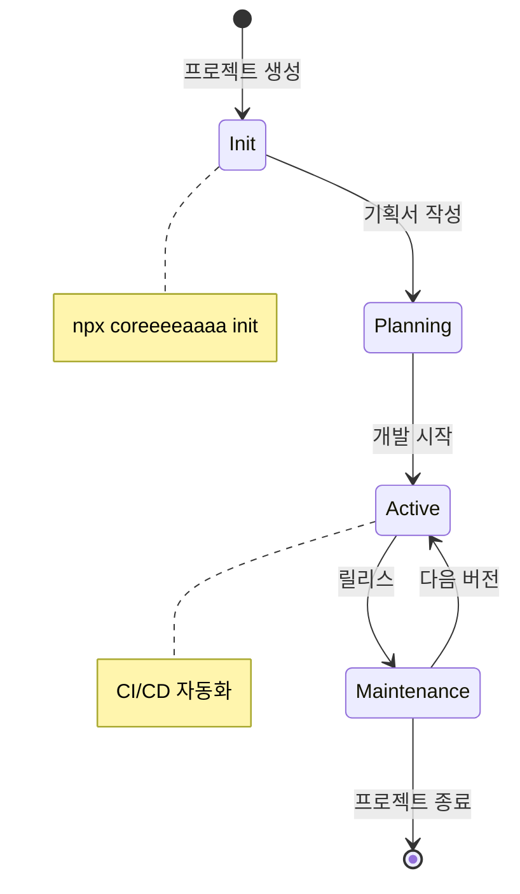
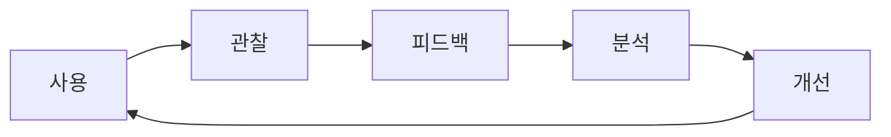

# coreeeeaaaa 유지보수 및 운영 관리

> **V3.0.0 장기 유지보스 전략**
> 버전: 3.0.0
> 작성일: 2025-12-23

---

## 📋 개요

### 목적
coreeeeaaaa Framework 자체와 이 프레임워크로 관리하는 모든 프로젝트의 **장기 유지보수, 운영, 개선**을 위한 체계적인 접근 방식을 정의합니다.

### 적용 범위
1. **coreeeeaaaa 자체**: 프레임워크 자체의 유지보수
2. **관리 프로젝트**: coreeeeaaaa로 관리하는 프로젝트의 운영

---

## 🔄 coreeeeaaaa 자체 관리

### 1. 자가 관리 시스템



### 2. 자가 진단 체크리스트

```yaml
# .coreeeeaaaa/hooks/self-diagnosis.sh
일간 진단:
  - [ ] Git 상태 정상 (clean/committed)
  - [ ] 의존성 최신 (npm audit 통과)
  - [ ] MCP 서버 정상 (health check 성공)
  - [ ] 로그 파일 크기 정상 (<100MB)
  - [ ] 백업 완료 (최근 24시간 내)

주간 진단:
  - [ ] 모든 테스트 통과
  - [ ] 코드 커버리지 >80%
  - [ ] 문서 최신 상태
  - [ ] 이슈 0건 (해결됨)
  - [ ] PR 0건 (머지됨)

월간 진단:
  - [ ] 성능 벤치마킹
  - [ ] 보안 감사
  - [ ] 의존성 업데이트
  - [ ] 문서 전면 검토
  - [ ] 아키텍처 검토
```

### 3. 자동 업데이트 시스템

```typescript
// .coreeeeaaaa/hooks/auto-update.ts
class AutoUpdateSystem {
  async checkForUpdates(): Promise<UpdateInfo> {
    // GitHub에서 최신 버전 확인
    const latest = await this.getLatestRelease();
    const current = this.getCurrentVersion();

    if (semver.gt(latest, current)) {
      return {
        available: true,
        current,
        latest,
        critical: semver.diff(latest, current) === 'major'
      };
    }

    return { available: false };
  }

  async applyUpdate(update: UpdateInfo): Promise<void> {
    // 1. 백업 생성
    await this.createBackup();

    // 2. 변경사항 다운로드
    await this.downloadChanges(update.latest);

    // 3. 테스트 실행
    const testResult = await this.runTests();

    if (!testResult.success) {
      // 롤백
      await this.rollback();
      throw new Error('Update failed: tests did not pass');
    }

    // 4. 업데이트 적용
    await this.applyChanges();

    // 5. 재시작
    await this.restart();
  }
}
```

---

## 📊 프로젝트 관리

### 1. 프로젝트 라이프사이클



### 2. 프로젝트 템플릿 관리

```bash
# 새 프로젝트 생성
npx coreeeeaaaa init my-project

# 자동 생성되는 구조
my-project/
├── .coreeeeaaaa/
│   ├── specs/              # SpecKit 명세
│   ├── state_management/   # 상태 관리
│   └── persistence/        # 체크포인트
├── docs/                   # 프로젝트 문서
├── src/                    # 소스 코드
└── tests/                  # 테스트
```

### 3. CI/CD 파이프라인

```yaml
# .github/workflows/coreeeeeaaaa-ci.yml
name: coreeeeaaaa CI

on: [push, pull_request]

jobs:
  quality-gate:
    runs-on: ubuntu-latest
    steps:
      - uses: actions/checkout@v3

      - name: Setup Node.js
        uses: actions/setup-node@v3
        with:
          node-version: '18'

      - name: Install dependencies
        run: npm ci

      - name: Run tests
        run: npm test

      - name: Run gate
        run: npx coreeeeaaaa gate

      - name: Security scan
        run: npm audit --audit-level=moderate

      - name: Upload coverage
        uses: codecov/codecov-action@v3
```

---

## 🔍 모니터링 및 알림

### 1. 메트릭 수집

```typescript
// .coreeeeaaaa/state_management/metrics.json
{
  "metrics": {
    "agent_health": {
      "boosaan": "healthy",
      "uijeongboo": "healthy",
      "oolsaan": "healthy",
      "ilsaan": "healthy"
    },
    "system_metrics": {
      "uptime": "99.9%",
      "memory_usage": "256MB",
      "cpu_usage": "15%",
      "disk_usage": "45%"
    },
    "project_metrics": {
      "active_projects": 3,
      "total_commits": 127,
      "open_issues": 2,
      "merge_conflicts": 0
    }
  }
}
```

### 2. 알림 시스템

```yaml
# .coreeeeaaaa/config/alerts.yaml
alerts:
  critical:
    - condition: "agent_health == 'down'"
      message: "에이전트 다운"
      channels: [slack, email]

    - condition: "security_vulnerability == true"
      message: "보안 취약점 발견"
      channels: [slack, email, sms]

  warning:
    - condition: "memory_usage > 80%"
      message: "메모리 사용량 높음"
      channels: [slack]

    - condition: "merge_conflicts > 0"
      message: "Git 충돌 발생"
      channels: [slack]
```

---

## 🛠️ 문제 해결

### 1. 일반적인 문제

| 문제 | 원인 | 해결 방법 |
|------|------|-----------|
| `npm install` 실패 | 의존성 충돌 | `rm -rf node_modules package-lock.json && npm install` |
| Git 충돌 | 동시 커밋 | `.github/scripts/resolve-conflict.sh` 실행 |
| MCP 서버 연결 실패 | 포트 충돌 | 포트 변경 또는 프로세스 종료 |
| gate 검증 실패 | 코드/테스트 문제 | 로그 확인 후 수정 |

### 2. 긴급 상황 대응

```bash
# .github/scripts/emergency-response.sh
#!/bin/bash

case $1 in
  "system_down")
    echo "시스템 다운 감지"
    # 1. 최신 백업 확인
    # 2. 깨끗한 환경에 복원
    # 3. 기능 테스트
    ;;

  "security_breach")
    echo "보안 침해 감지"
    # 1. 시스템 격리
    # 2. 로그 수집
    # 3. 포렌식 분석
    # 4. 패치 적용
    ;;

  "data_corruption")
    echo "데이터 손상 감지"
    # 1. 손상 범위 확인
    # 2. 백업에서 복구
    # 3. 무결성 검증
    ;;
esac
```

---

## 📈 성능 최적화

### 1. 정기 성능 검토

```yaml
월간:
  - 응답 시간 측정 (p50, p95, p99)
  - 처리량 측정 (RPS)
  - 리소스 사용량 분석
  - 병목 지점 식별

분기:
  - 전체 성능 벤치마킹
  - 스트레스 테스트
  - 용량 계획 수립
  - 최적화 작업 실행
```

### 2. 최적화 기법

```typescript
// .coreeeeaaaa/hooks/optimization.ts
class Optimizer {
  // 1. 캐싱
  private cache = new Map();

  async get(key: string): Promise<any> {
    if (this.cache.has(key)) {
      return this.cache.get(key);
    }

    const value = await this.fetchFromSource(key);
    this.cache.set(key, value);
    return value;
  }

  // 2. 병렬 처리
  async parallel<T>(tasks: (() => Promise<T>)[]): Promise<T[]> {
    return Promise.all(tasks.map(task => task()));
  }

  // 3. 지연 로딩
  async lazyLoad<T>(loader: () => Promise<T>): Promise<T> {
    return loader();
  }
}
```

---

## 📚 문서 관리

### 1. 문서 버전 관리

```yaml
# .coreeeeaaaa/docs/VERSIONS.md
versions:
  v1.0:
    date: "2025-12-23"
    changes:
      - 최초 작성
      - 리스크 관리 추가
      - 시각화 추가

  v1.1:
    date: "2025-12-30"
    changes:
      - 유지보스 관리 추가
      - 성능 최적화 추가
```

### 2. 문서 자동 업데이트

```typescript
// .coreeeeaaaa/hooks/doc-sync.ts
class DocumentationSync {
  async syncFromCode(): Promise<void> {
    // 코드에서 주석 추출
    const comments = await this.extractComments();

    // 문서 생성
    const docs = await this.generateDocs(comments);

    // 문서 저장
    await this.saveDocs(docs);
  }

  async validate(): Promise<void> {
    // 문서와 코드 일치성 검증
    const code = await this.loadCode();
    const docs = await this.loadDocs();

    const inconsistencies = await this.findInconsistencies(code, docs);

    if (inconsistencies.length > 0) {
      console.warn('문서 불일치 감지:', inconsistencies);
    }
  }
}
```

---

## 🎯 지속적 개선

### 1. 피드백 루프



### 2. A/B 테스트

```typescript
// .coreeeeaaaa/hooks/ab-testing.ts
class ABTesting {
  async runTest(testName: string): Promise<TestResult> {
    const groupA = await this.getGroup('A');
    const groupB = await this.getGroup('B');

    const resultA = await this.measure(groupA);
    const resultB = await this.measure(groupB);

    return {
      winner: resultA.conversion > resultB.conversion ? 'A' : 'B',
      uplift: Math.abs(resultA.conversion - resultB.conversion),
      confidence: this.calculateConfidence(resultA, resultB)
    };
  }
}
```

---

## 📞 지원 및 문의

### 문제 신청
```bash
# 이슈 생성
gh issue create \
  --title "제목" \
  --body "문제 상세 설명"
```

### 기능 요청
```bash
# PR 생성
gh pr create \
  --title "feat: 새로운 기능" \
  --body "기능 상세 설명"
```

---

**© 2025 coreeeeaaaa Framework. All rights reserved.**
