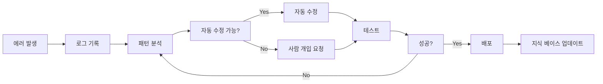

# coreeeeaaaa 리스크 관리 및 예외 처리

> **V3.0.0 리스크 관리 시스템**
> 버전: 3.0.0
> 작성일: 2025-12-23

---

## 📋 개요

### 목적
coreeeeaaaa Framework와 이 프레임워크로 관리하는 프로젝트의 **리스크 식별, 평가, 완화, 모니터링**을 체계화합니다.

### 적용 범위
1. **coreeeeaaaa 자체**: 프레임워크 자체의 리스크 관리
2. **관리 프로젝트**: coreeeeaaaa로 관리하는 모든 프로젝트의 리스크 관리

---

## 🎯 리스크 카테고리

### 1. 기술적 리스크

#### 1.1 Git 충돌
```yaml
리스크: 여러 AI 에이전트가 동시에 같은 파일 수정
확률: 높음
영향: 중간
```

**예방 조치:**
```yaml
전략: Branch-per-Agent
  - 각 에이전트는 전용 브랜치 사용
  - main 브랜치는 PR로만 병합
  - GitHub Actions에서 자동 충돌 감지

구현:
  - boosaan/develop
  - uijeongboo/design
  - oolsaan/test
  - ilsaan/deploy
```

**완화 조치:**
```bash
# 충돌 발생 시 자동 해결 스크립트
#!/bin/bash
# .github/scripts/resolve-conflict.sh

git fetch origin main
git rebase origin/main

if [ $? -ne 0 ]; then
  echo "충돌 감지됨"

  # 1. 충돌 파일 목록 추출
  CONFLICTS=$(git diff --name-only --diff-filter=U)

  # 2. AI에게 충돌 해결 요청
  for file in $CONFLICTS; do
    echo "충돌 파일: $file"
    # resolve-conflict-with-ai.sh $file
  done

  # 3. 해결 후 재시도
  git rebase --continue
fi
```

#### 1.2 의존성 충돌
```yaml
리스크: npm 패키지 버전 불일치
확률: 중간
영향: 높음
```

**예방 조치:**
```json
// package.json
{
  "engines": {
    "node": ">=18.0.0 <19.0.0",
    "npm": ">=9.0.0"
  },
  "overrides": {
    "typescript": "5.3.3"
  }
}
```

**완화 조치:**
```bash
# .github/scripts/dependency-check.sh
npm ci
npm audit --audit-level=moderate

if [ $? -ne 0 ]; then
  npm audit fix
  git commit -am "fix: security vulnerabilities"
fi
```

#### 1.3 MCP 서버 연결 실패
```yaml
리스크: Serena/Conglruo MCP 서버 다운
확률: 낮음
영향: 높음
```

**완화 조치:**
```typescript
// 자동 재연결 로직
class MCPManager {
  private maxRetries = 3;
  private retryDelay = 5000; // 5초

  async connect(serverUrl: string): Promise<void> {
    for (let i = 0; i < this.maxRetries; i++) {
      try {
        await this.tryConnect(serverUrl);
        return;
      } catch (error) {
        if (i === this.maxRetries - 1) {
          throw new Error(`MCP 서버 연결 실패: ${error}`);
        }
        await this.delay(this.retryDelay);
      }
    }
  }
}
```

### 2. 운영적 리스크

#### 2.1 에이전트 간 통신 실패
```yaml
리스크: 에이전트가 다른 에이전트의 결과를 못 받음
확률: 중간
영향: 높음
```

**완화 조치:**
```typescript
// .coreeeeaaaa/state_management/agent-registry.json
{
  "agents": {
    "boosaan": {
      "status": "waiting_for_input",
      "last_heartbeat": "2025-12-23T10:23:45Z",
      "timeout": 300000, // 5분
      "fallback_strategy": "retry_3_times_then_skip"
    }
  }
}
```

**예외 처리:**
```typescript
// 타임아웃 시 자동 재시도
async function executeWithRetry<T>(
  task: () => Promise<T>,
  maxRetries = 3
): Promise<T> {
  for (let i = 0; i < maxRetries; i++) {
    try {
      return await task();
    } catch (error) {
      if (i === maxRetries - 1) {
        // 실패 기록
        await logFailure(error);
        throw error;
      }
      await delay(1000 * (i + 1)); // 지수 백오프
    }
  }
}
```

#### 2.2 상태 동기화 실패
```yaml
리스크: .persistence/agent_memory/ 손상
확률: 낮음
영향: 높음
```

**예방 조치:**
```typescript
// 정기 백업
class BackupManager {
  async backupState(): Promise<void> {
    const timestamp = new Date().toISOString();
    await fs.copy(
      '.persistence/agent_memory/',
      `.persistence/backups/backup-${timestamp}/`
    );
  }

  // 주기적으로 실행 (cron: 0 */6 * * *)
  // 최근 7일 백업만 보관
}
```

**복구 절차:**
```bash
# .github/scripts/restore-state.sh
LATEST_BACKUP=$(ls -t .persistence/backups/ | head -1)

if [ -f ".persistence/agent_memory/.corrupted" ]; then
  echo "손상 감지됨. 백업에서 복구 중..."
  rm -rf .persistence/agent_memory/
  cp -r ".persistence/backups/$LATEST_BACKUP" .persistence/agent_memory/
  echo "복구 완료"
fi
```

### 3. 보안 리스크

#### 3.1 인증 정보 노출
```yaml
리스크: API 키가 Git에 커밋됨
확률: 낮음
영향: 치명적
```

**예방 조치:**
```yaml
# .gitignore 강화
.gitignore:
  - .env*
  - *.key
  - *.pem
  - secrets/

# Pre-commit hook
- name: Detect secrets
  run: |
    npx gitleaks detect --source . --report-format json
```

**대응 절차:**
```bash
# 노출 감지 시 즉시 실행
#!/bin/bash
# .github/scripts/rotate-secrets.sh

# 1. 해당 시크릿 무효화
# 2. 새 시크릿 생성
# 3. Git 기록에서 제거 (git filter-repo)
# 4. 강제 push (주의: 공유 브랜치면 하지 말 것)
```

#### 3.2 MCP 서버 무단 접근
```yaml
리스크: 외부에서 Serena MCP 서버 접근
확률: 낮음
영향: 높음
```

**예방 조치:**
```typescript
// 인증된 클라이언트만 허용
const ALLOWED_CLIENTS = [
  '127.0.0.1',
  '::1'
];

server.addEventListener('connection', (socket) => {
  const clientIP = socket.remoteAddress;

  if (!ALLOWED_CLIENTS.includes(clientIP)) {
    socket.close();
    logSecurityEvent(`Unauthorized connection from ${clientIP}`);
  }
});
```

---

## 🔄 예외 처리 및 내부 개선 순환

### 1. 피드백 루프



### 2. 자가 치유 시스템

```typescript
// .coreeeeaaaa/hooks/self-healing.ts
class SelfHealingSystem {
  async diagnose(error: Error): Promise<Diagnosis> {
    const diagnosis = await this.analyzeError(error);

    switch (diagnosis.type) {
      case 'DEPS_CONFLICT':
        return {
          action: 'RUN_NPM_AUDIT_FIX',
          confidence: 0.9
        };

      case 'GIT_CONFLICT':
        return {
          action: 'RUN_GIT_REBASE',
          confidence: 0.7,
          requiresHumanReview: true
        };

      case 'MCP_DISCONNECT':
        return {
          action: 'RESTART_MCP_SERVER',
          confidence: 0.95
        };

      default:
        return {
          action: 'ESCALATE_TO_HUMAN',
          confidence: 0.0
        };
    }
  }

  async applyFix(diagnosis: Diagnosis): Promise<void> {
    if (diagnosis.confidence < 0.8) {
      await this.notifyHuman(diagnosis);
      return;
    }

    const result = await this.executeFix(diagnosis.action);

    if (result.success) {
      await this.learnFromSuccess(diagnosis);
    } else {
      await this.learnFromFailure(diagnosis, result);
    }
  }
}
```

### 3. 지식 베이스 업데이트

```yaml
# .coreeeeaaaa/knowledge/solutions.yaml
solutions:
  - problem: "npm install failed with ERESOLVE"
    solution: |
      1. rm -rf node_modules package-lock.json
      2. npm cache clean --force
      3. npm install --legacy-peer-deps
    success_rate: 0.95
    last_used: "2025-12-23T10:00:00Z"

  - problem: "Git rebase conflict in package.json"
    solution: |
      1. git rebase --abort
      2. git merge origin/main --strategy-option=theirs
      3. 수동으로 package.json 병합
    success_rate: 0.8
    requires_human_review: true
```

---

## 📊 리스크 모니터링

### 1. 대시보드

```typescript
// .coreeeeaaaa/state_management/risk-monitor.json
{
  "risks": {
    "git_conflicts": {
      "level": "medium",
      "occurrences": 3,
      "last_occurrence": "2025-12-23T09:30:00Z",
      "trend": "decreasing"
    },
    "mcp_disconnect": {
      "level": "low",
      "occurrences": 0,
      "last_occurrence": null,
      "trend": "stable"
    }
  }
}
```

### 2. 알림

```yaml
# .coreeeeaaaa/config/alerts.yaml
alerts:
  - name: "High Risk Level"
    condition: "risk_level > 7"
    channels: [slack, email]

  - name: "Repeated Failure"
    condition: "same_failure_count > 3"
    channels: [slack]

  - name: "Security Breach"
    condition: "security_event == true"
    channels: [slack, email, sms]
    priority: critical
```

---

## 🛡️ 유지보수 관리

### 1. 정기 점검

```yaml
일일:
  - 에러 로그 검토
  - 백업 상태 확인
  - MCP 서버 상태 확인

주간:
  - 리스크 레벨 검토
  - 의존성 업데이트
  - 보안 스캔

월간:
  - 전체 시스템 감사
  - 성능 벤치마킹
  - 재해 복구 훈련
```

### 2. 재해 복구 계획

```yaml
시나리오 1: 전체 시스템 다운
  복구 시간 목표: 1시간
  절차:
    1. 최신 백업 확인
    2. 깨끗한 환경에 복원
    3. 기능 테스트
    4. DNS 전환

시나리오 2: Git 저장소 손상
  복구 시간 목표: 30분
  절차:
    1. GitHub 백업 확인
    2. 로컬 복제본으로 복구
    3. 모든 브랜치 검증
```

---

## 📚 관련 문서

- **[ARCHITECTURE.md](./ARCHITECTURE.md)**: 시스템 아키텍처
- **[AI_TEAM_WORKFLOW.md](./AI_TEAM_WORKFLOW.md)**: 워크플로우 가이드
- **[TROUBLESHOOTING.md](./TROUBLESHOOTING.md)**: 문제 해결 가이드

---

**© 2025 coreeeeaaaa Framework. All rights reserved.**
