# coreeeeaaaa 시스템 시각화

> **V3.0.0 아키텍처 다이어그램**
> 버전: 3.0.0
> 작성일: 2025-12-23

---

## 📊 전체 시스템 아키텍처

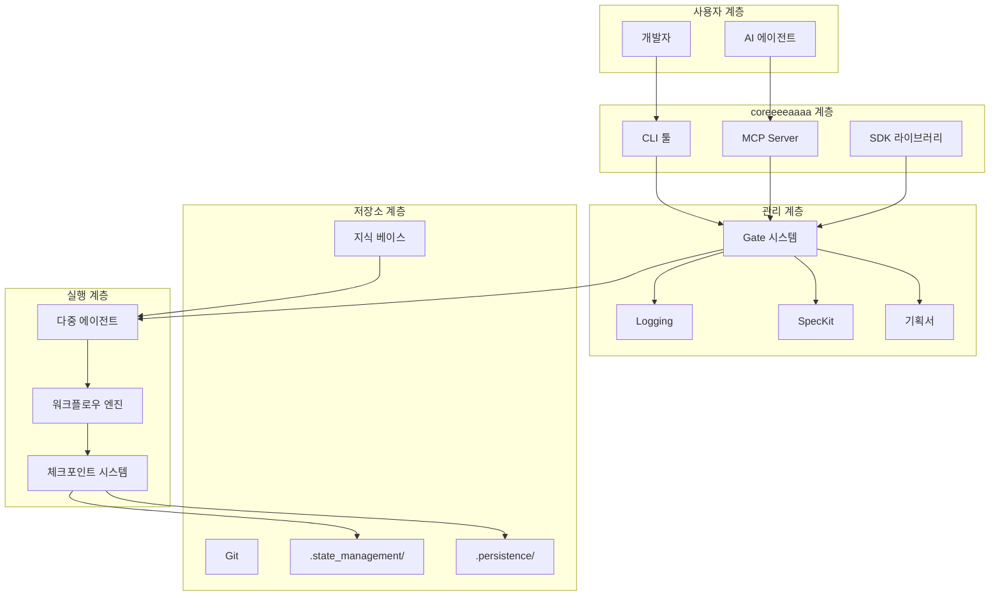

---

## 🔄 AI 팀 협업 워크플로우

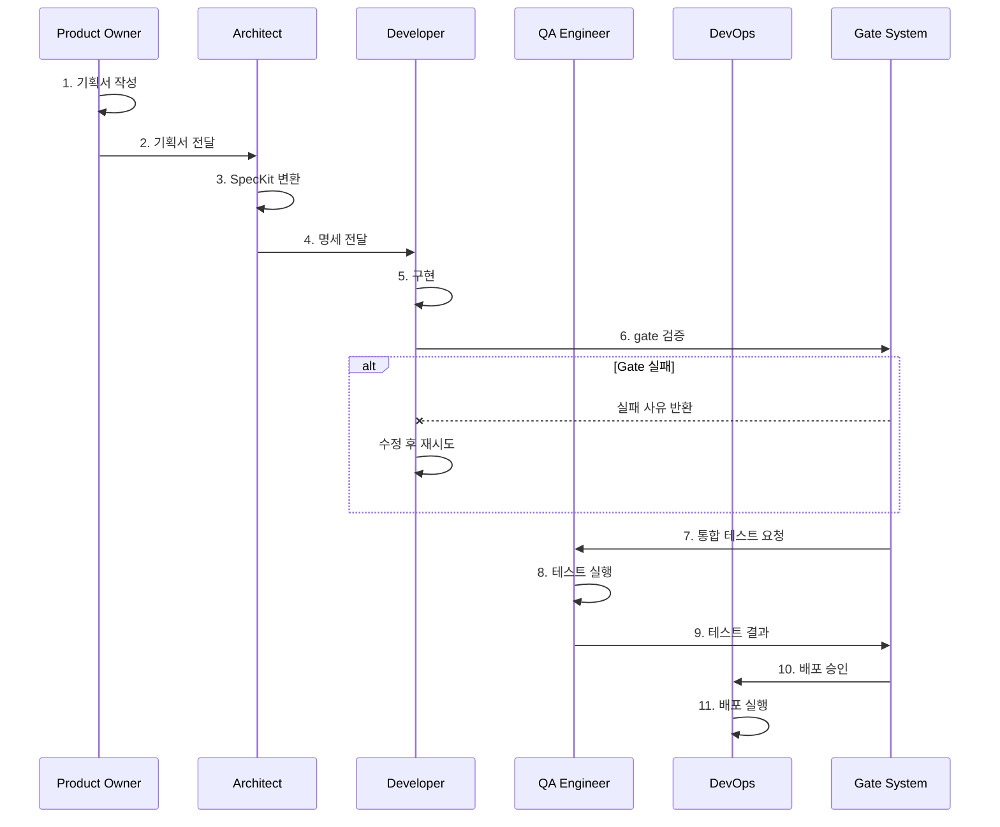

---

## 🤖 다중 에이전트 협업 시스템

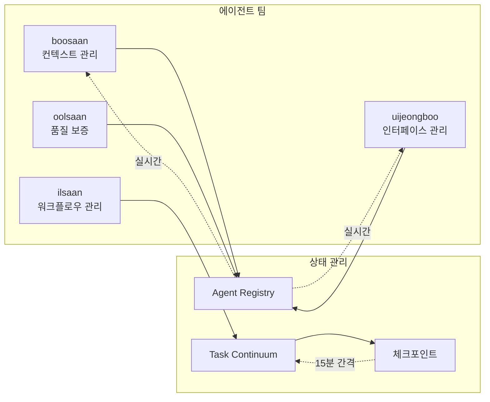

---

## 🔐 보안 및 리스크 관리

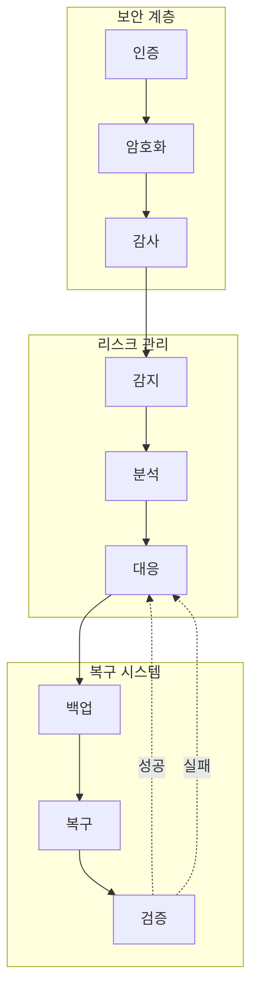

---

## 📈 프로젝트 관리 라이프사이클

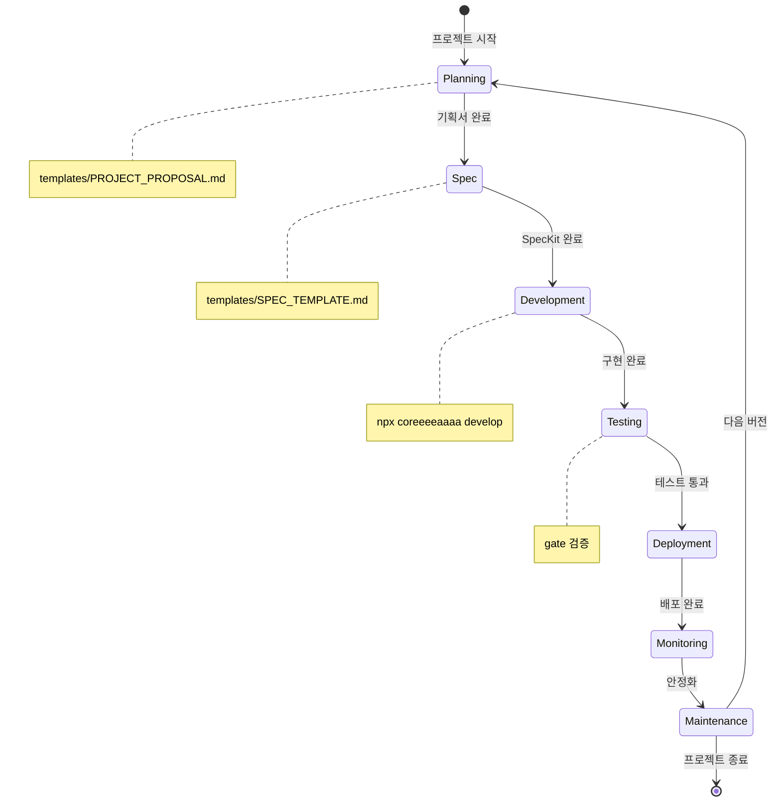

---

## 🗂️ 데이터 흐름

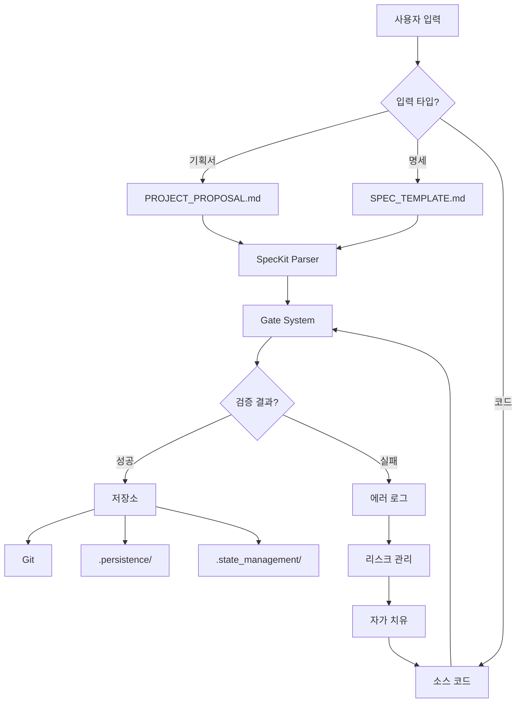

---

## 🎯 Spec-Driven Development 파이프라인

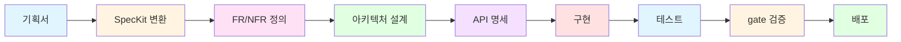

---

## 🔄 내부 개선 순환

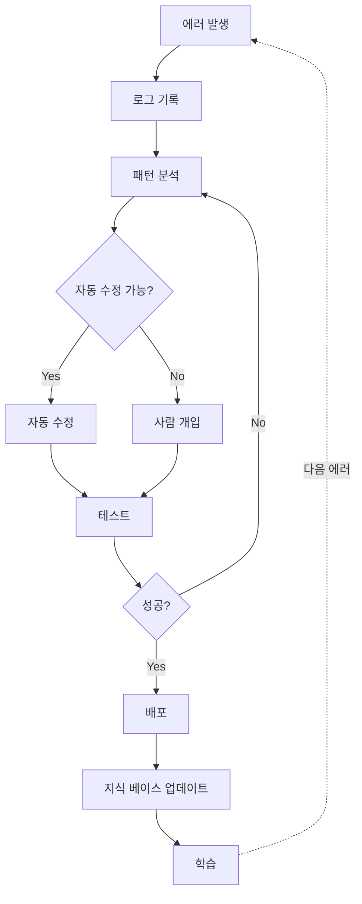

---

## 📊 모니터링 대시보드

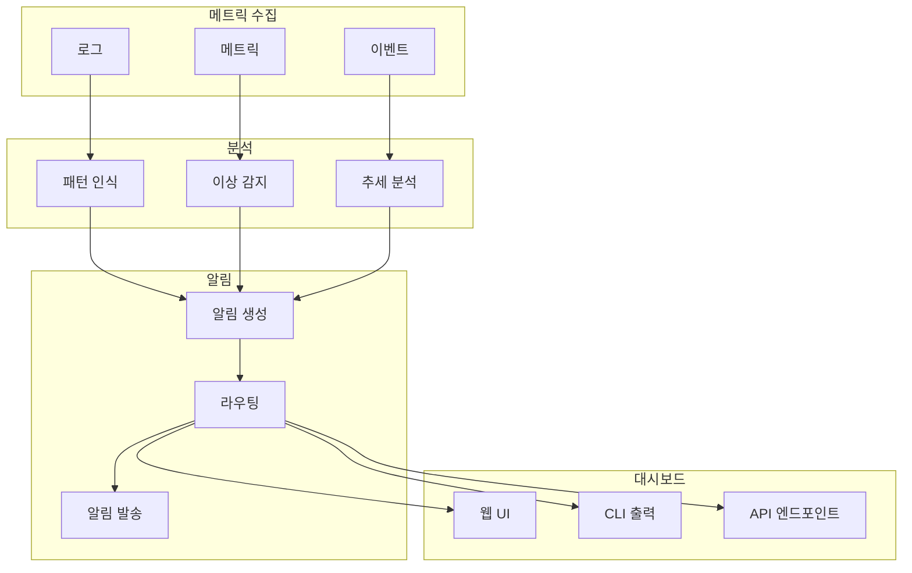

---

## 🛡️ Git 전략

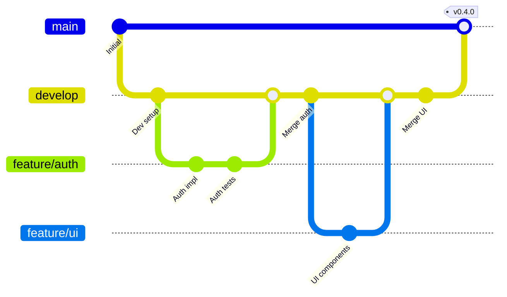

---

## 📚 파일 구조

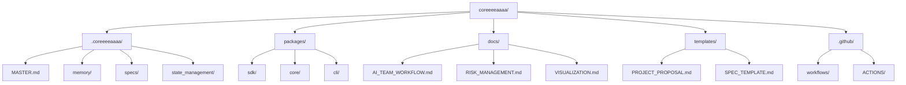

---

## 🔗 MCP 통합

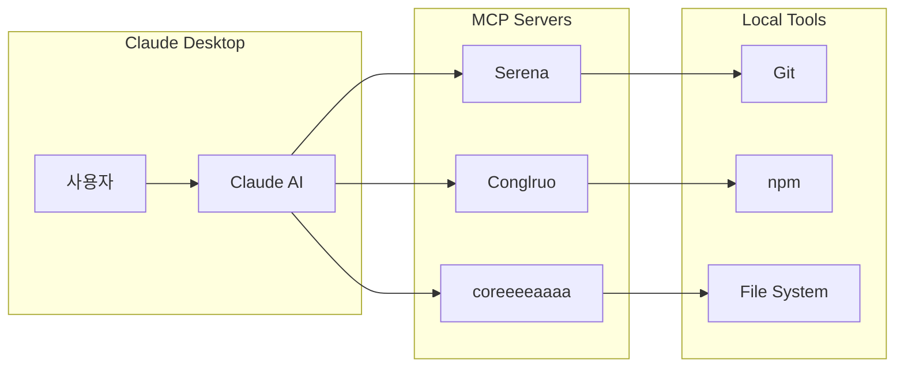

---

## 📖 사용 방법

### 로컬에서 보기
```bash
# Mermaid CLI 설치
npm install -g @mermaid-js/mermaid-cli

# 다이어그램 렌더링
mmdc -i VISUALIZATION.md -o output.png
```

### 웹에서 보기
1. GitHub에 푸시하면 자동 렌더링
2. VS Code: Mermaid Preview 확장프로그램 설치
3. 온라인: https://mermaid.live/

---

**© 2025 coreeeeaaaa Framework. All rights reserved.**
