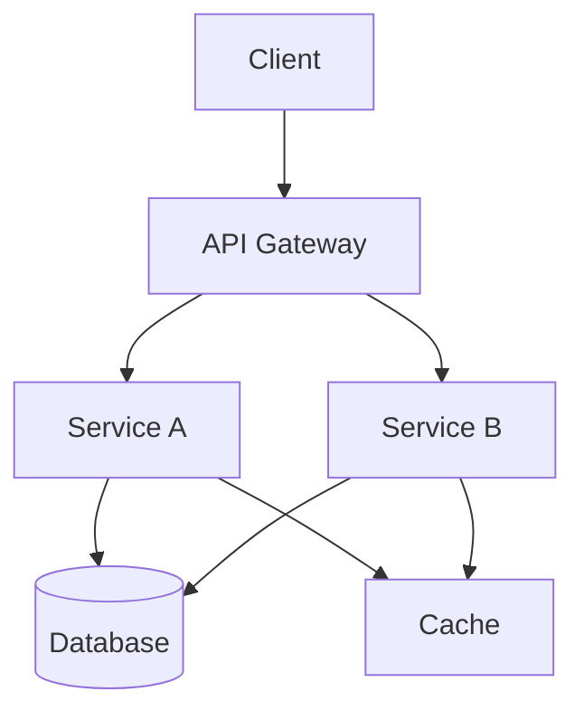

# Spec: [프로젝트 이름]

> **Spec-Driven Development 표준 템플릿**
> 버전: 1.0
> 상태: Draft | Review | Approved
> 작성일: YYYY-MM-DD

---

## Metadata

```yaml
spec:
  name: [프로젝트 영문명]
  version: 1.0.0
  status: Draft
  authors:
    - Product Owner AI
    - Architect AI
  created: 2025-12-23
  modified: 2025-12-23
  repository: [GitHub URL]
```

---

## 1. Overview

### 1.1 Project Summary
**한줄 설명**: [20단어 이내로 핵심 가치 제시]

### 1.2 Background
- **문제**: [현재 문제점]
- **해결 필요성**: [왜 지금 해결해야 하는가?]
- **시장성**: [실제 가치]

### 1.3 Success Criteria
- [ ] [정량적 지표 1]
- [ ] [정량적 지표 2]
- [ ] [정성적 지표 1]

---

## 2. Requirements

### 2.1 Functional Requirements

#### FR-001: [기능 요구사항 명]
```yaml
priority: P0 | P1 | P2
category: Core | Enhancement | Optimization
description: |
  [상세 설명]

acceptance_criteria:
  - [조건 1]: [구체적 기준]
  - [조건 2]: [구체적 기준]
  - [조건 3]: [구체적 기준]

technical_notes: |
  [기술적 고려사항]

dependencies:
  - FR-XXX: [의존성 설명]

estimated_effort:
  development: "4시간"
  testing: "2시간"
```

#### FR-002: [기능 요구사항 명]
[동일 구조 반복]

### 2.2 Non-Functional Requirements

#### NFR-001: [비기능 요구사항 명]
```yaml
priority: P0 | P1 | P2
category: Performance | Security | Maintainability | Scalability

description: |
  [상세 설명]

metrics:
  - name: [측정 지표명]
    target: [목표치]
    measurement: [측정 방법]

testing_approach: |
  [검증 방법]
```

#### NFR-002: Security
```yaml
priority: P0
category: Security

requirements:
  - 개인정보 암호화 (AES-256)
  - API 인증 (JWT)
  - SQL Injection 방어
  - XSS 방어

compliance:
  - 개인정보보호법
  - GDPR (필요시)
```

#### NFR-003: Performance
```yaml
priority: P1
category: Performance

requirements:
  - name: API 응답 시간
    target: p95 < 200ms
    measurement: Apache Bench

  - name: 처리량
    target: 1000 RPS
    measurement: k6

  - name: 메모리 사용량
    target: < 512MB
    measurement: heap snapshot
```

---

## 3. Architecture

### 3.1 System Overview



### 3.2 Component Design

#### Component A: [컴포넌트 명]
```yaml
responsibility: |
  [책임 설명]

interface:
  inputs:
    - name: [입력명]
      type: [타입]
      description: [설명]
  outputs:
    - name: [출력명]
      type: [타입]
      description: [설명]

dependencies:
  - [의존 컴포넌트/라이브러리]

tech_stack:
  - language: TypeScript
  - framework: Express.js
```

### 3.3 Data Models

```typescript
// Entity: [엔티티 명]

interface User {
  /** Primary Key */
  id: string;

  /** 사용자 이름 */
  name: string;

  /** 이메일 주소 (unique) */
  email: string;

  /** 생성일시 */
  createdAt: Date;

  /** 수정일시 */
  updatedAt: Date;
}

// Relations
interface Post {
  id: string;
  authorId: string; // Foreign Key to User
  title: string;
  content: string;
  createdAt: Date;
}
```

### 3.4 API Specification

#### REST API

```http
### GET /api/users
**Description**: 사용자 목록 조회

**Query Parameters**:
- `page`: number (default: 1)
- `limit`: number (default: 20, max: 100)
- `sort`: string (default: "createdAt")

**Response**:
```json
{
  "data": [
    {
      "id": "uuid",
      "name": "string",
      "email": "string",
      "createdAt": "ISO8601"
    }
  ],
  "meta": {
    "total": 100,
    "page": 1,
    "limit": 20
  }
}
```

**Error Responses**:
- `400 Bad Request`: Invalid parameters
- `401 Unauthorized`: Not authenticated
- `403 Forbidden`: Not authorized
```

```http
### POST /api/users
**Description**: 신규 사용자 생성

**Request Body**:
```json
{
  "name": "string (required, min: 2, max: 50)",
  "email": "string (required, email format)"
}
```

**Response**: `201 Created`
```json
{
  "id": "uuid",
  "name": "string",
  "email": "string",
  "createdAt": "ISO8601"
}
```

**Error Responses**:
- `400 Bad Request`: Validation error
- `409 Conflict`: Email already exists
```

---

## 4. Implementation Plan

### 4.1 Phase 1: Foundation (Week 1)
```yaml
goal: 개발 기반 구축

tasks:
  - task: "프로젝트 초기화"
    assignee: Developer AI
    effort: "2시간"
    dependencies: []

  - task: "데이터베이스 스키마 설계"
    assignee: Architect AI
    effort: "4시간"
    dependencies: ["프로젝트 초기화"]

  - task: "CI/CD 파이프라인 구축"
    assignee: DevOps AI
    effort: "6시간"
    dependencies: ["프로젝트 초기화"]

deliverables:
  - 프로젝트 구조 완성
  - 데이터베이스 스키마
  - CI/CD 파이프라인

acceptance_criteria:
  - 로컬 개발 환경 실행 가능
  - CI 파이프라인 통과
  - 데이터베이스 마이그레이션 성공
```

### 4.2 Phase 2: Core Features (Week 2)
```yaml
goal: 핵심 기능 구현

tasks:
  - task: "FR-001 구현"
    assignee: Developer AI
    effort: "8시간"
    dependencies: ["데이터베이스 스키마 설계"]

  - task: "FR-002 구현"
    assignee: Developer AI
    effort: "6시간"
    dependencies: ["FR-001 구현"]

deliverables:
  - 핵심 기능 구현 완료
  - 단위 테스트 통과
  - 통합 테스트 통과

acceptance_criteria:
  - 모든 FR-001~FR-003 구현 완료
  - 테스트 커버리지 90% 이상
  - 성능 기준 충족
```

### 4.3 Phase 3: Testing & QA (Week 3)
```yaml
goal: 품질 검증

tasks:
  - task: "통합 테스트 작성"
    assignee: QA Engineer AI
    effort: "8시간"
    dependencies: ["핵심 기능 구현"]

  - task: "E2E 테스트 작성"
    assignee: QA Engineer AI
    effort: "8시간"
    dependencies: ["통합 테스트 작성"]

deliverables:
  - 테스트 스위트 완성
  - 테스트 리포트
  - 버그 수정 완료

acceptance_criteria:
  - 주요 경로 100% 테스트
  - 치명적 버그 0개
  - 성능 기준 충족
```

---

## 5. Testing Strategy

### 5.1 Test Pyramid

```
        /\
       /  \      E2E Tests (10%)
      /----\     - Critical user flows
     /      \    - Playwright
    /--------\
   /          \  Integration Tests (30%)
  /------------\ - API contracts
 /  Unit Tests  \ - Component integration
/________________\
 (60%)
- Jest
- Individual functions
```

### 5.2 Unit Tests

```yaml
framework: Jest
coverage_target: 90%

example_tests:
  - describe: "UserService.createUser"
    test_cases:
      - should create user with valid data
      - should throw error with duplicate email
      - should hash password before saving
      - should send welcome email
```

### 5.3 Integration Tests

```yaml
framework: Supertest
coverage_target: Critical paths 100%

example_tests:
  - describe: "POST /api/users"
    test_cases:
      - should create user and return 201
      - should return 400 with invalid email
      - should return 409 with duplicate email
```

### 5.4 E2E Tests

```yaml
framework: Playwright
coverage_target: Critical flows 100%

example_flows:
  - name: "User Registration Flow"
    steps:
      1. Navigate to registration page
      2. Fill in valid user data
      3. Submit form
      4. Verify welcome email sent
      5. Verify user can login
```

---

## 6. Deployment Strategy

### 6.1 Environments

```yaml
environments:
  development:
    url: http://localhost:3000
    database: SQLite (local)

  staging:
    url: https://staging.example.com
    database: PostgreSQL (cloud)
    auto_deploy: true

  production:
    url: https://api.example.com
    database: PostgreSQL (cloud)
    auto_deploy: false (manual approval)
```

### 6.2 Deployment Pipeline

```yaml
pipeline:
  stage_1: Build
    - npm install
    - npm run build
    - Docker image build

  stage_2: Test
    - npm test
    - npm run test:integration
    - npm run test:e2e

  stage_3: Security Scan
    - npm audit
    - Snyk scan
    - OWASP dependency check

  stage_4: Deploy Staging
    - Deploy to staging environment
    - Smoke tests
    - Performance tests

  stage_5: Deploy Production
    - Manual approval required
    - Blue-green deployment
    - Health check validation
```

---

## 7. Monitoring & Observability

### 7.1 Metrics

```yaml
business_metrics:
  - name: "Daily Active Users"
    query: "count(distinct user_id) where date = today"

  - name: "Conversion Rate"
    query: "conversions / visits * 100"

technical_metrics:
  - name: "API Response Time (p95)"
    target: "< 200ms"

  - name: "Error Rate"
    target: "< 0.1%"

  - name: "Uptime"
    target: "99.9%"
```

### 7.2 Alerting

```yaml
alerts:
  - name: "High Error Rate"
    condition: "error_rate > 1% for 5min"
    severity: critical
    channels: [slack, email]

  - name: "Slow Response Time"
    condition: "p95_response_time > 500ms for 10min"
    severity: warning
    channels: [slack]
```

---

## 8. Risk Management

### 8.1 Technical Risks

```yaml
risk_1:
  name: "Database Performance"
  probability: Medium
  impact: High
  mitigation:
    - Database indexing
    - Query optimization
    - Caching strategy
    - Read replica setup

risk_2:
  name: "Third-party API Dependency"
  probability: Low
  impact: Medium
  mitigation:
    - Circuit breaker pattern
    - Fallback implementation
    - Rate limiting
    - Monitoring integration
```

---

## 9. Maintenance & Support

### 9.1 Documentation Requirements

```yaml
required_docs:
  - API Documentation (OpenAPI/Swagger)
  - Architecture Decision Records (ADRs)
  - Runbooks (operational procedures)
  - Troubleshooting Guides
```

### 9.2 On-Call Procedures

```yaml
severity_levels:
  P0 - Critical:
    - System down
    - Data loss
    - Security breach
    response_time: "15 minutes"

  P1 - High:
    - Major functionality broken
    - Performance degradation
    response_time: "1 hour"

  P2 - Medium:
    - Minor functionality broken
    - Non-critical bugs
    response_time: "4 hours"
```

---

## 10. Appendix

### 10.1 Glossary
- **RAG**: Retrieval-Augmented Generation
- **MCP**: Model Context Protocol
- **SpecKit**: Spec-Driven Development Tool

### 10.2 References
- [Architecture Diagram](./architecture.md)
- [API Documentation](./api-docs.md)
- [Deployment Guide](./deployment.md)

---

## Changelog

| 버전 | 날짜 | 변경 내용 | 작성자 |
|------|------|-----------|--------|
| 1.0 | 2025-12-23 | 최초 작성 | AI Team |

---

**© 2025 coreeeeaaaa Framework. All rights reserved.**
